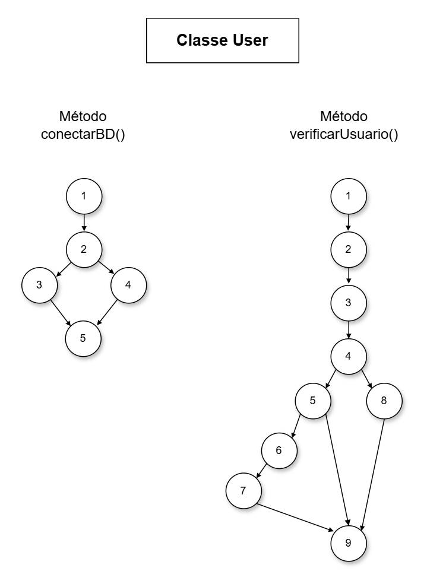

# Análise Estrutural de Código Java – Teste de Caixa Branca

## Introdução

Este projeto tem como objetivo realizar uma análise estrutural completa de um código Java responsável pela autenticação de usuários por meio de conexão com banco de dados.

A atividade foi desenvolvida aplicando conceitos de Teste de Caixa Branca, revisão estática de código, modelagem de fluxo de execução, cálculo de complexidade ciclomática e identificação de caminhos básicos. Além disso, foi realizada uma revisão técnica do código com o objetivo de identificar falhas, vulnerabilidades e oportunidades de melhoria.

---

## Análise Estática do Código

### Documentação

O código original não possui documentação adequada. Não foram encontrados comentários JavaDoc nas classes ou métodos, dificultando a compreensão da lógica implementada e a manutenção futura do sistema.

### Nomenclatura

A nomenclatura utilizada apresenta alguns problemas de legibilidade. Variáveis como `conn`, `rs` e `st` são abreviações comuns, porém reduzem a clareza do código. Além disso, existe mistura entre português e inglês nos identificadores.

### Legibilidade

Embora o código possua uma estrutura básica organizada, existem fatores que prejudicam sua legibilidade:

* concatenação excessiva de strings;
* ausência de separação de responsabilidades;
* atributos públicos desnecessários;
* falta de documentação;
* tratamento inadequado de exceções.

### NullPointerException

Foi identificado risco de ocorrência de `NullPointerException`.

Caso o método `conectarBD()` retorne `null`, a instrução abaixo poderá gerar erro em tempo de execução:

```java
Statement st = conn.createStatement();
```

### Segurança

Foram identificados diversos problemas relacionados à segurança:

* SQL Injection;
* senha armazenada em texto puro;
* credenciais expostas na string de conexão;
* ausência de criptografia de senha;
* ausência de validação de entrada;
* exceções ocultadas.

### Vulnerabilidades

O código apresenta vulnerabilidade de SQL Injection devido à construção da consulta SQL por concatenação de strings.

Exemplo:

```java
sql += "where login = '" + login + "'";
```

Essa prática permite que comandos maliciosos sejam inseridos pelo usuário.

### Conexões

Os recursos utilizados não são fechados corretamente.

Foram identificados:

* Connection
* Statement
* ResultSet

A ausência de fechamento pode causar desperdício de recursos e vazamento de conexões.

### Vulnerabilidades

O código apresenta vulnerabilidade de SQL Injection devido à construção da consulta SQL por concatenação de strings.

Exemplo:

```java
sql += "where login = '" + login + "'";
```

Essa prática permite que comandos maliciosos sejam inseridos pelo usuário.

### Tratamento de Exceções

O tratamento de exceções não foi implementado corretamente.

Os blocos `catch` estão vazios:

```java
catch (Exception e) {}
```

Essa prática dificulta a identificação de erros e o processo de depuração.

### Boas práticas

As principais más práticas encontradas foram:

* atributos públicos;
* concatenação de SQL;
* uso de Exception genérica;
* ausência de encapsulamento;
* ausência de fechamento de recursos;
* mistura de responsabilidades;
* falta de documentação.

---

## Grafo de Fluxo

O grafo de fluxo foi desenvolvido com o objetivo de representar visualmente o fluxo lógico de execução dos métodos `conectarBD()` e `verificarUsuario()`.



O diagrama permite identificar:

* fluxo principal;
* caminhos alternativos;
* estruturas condicionais;
* tratamento de exceções;
* pontos de retorno.

### Explicação do Fluxo

O fluxo inicia com a preparação da consulta SQL e a obtenção de uma conexão com o banco de dados. Em seguida, ocorre a execução da consulta dentro de um bloco try.

Após a execução, o sistema avalia a condição `rs.next()`. Caso seja verdadeira, significa que o usuário foi encontrado, e então o nome é armazenado e o resultado da autenticação é definido como verdadeiro.

Caso a condição seja falsa, ou ocorra alguma exceção durante a execução, o fluxo segue pelo caminho alternativo (false ou catch), retornando o valor padrão do resultado.

Por fim, o método retorna o resultado da verificação do usuário.

---

## Complexidade Ciclomática

A complexidade ciclomática foi calculada utilizando a fórmula:

V(G) = E − N + 2P

Onde:

* E = número de arestas;
* N = número de nós;
* P = número de componentes conectados.

### Cálculos

`conectarBD()`

V(G) = 5 − 5 + 2(1)
V(G) = 0 + 2
**V(G) = 2**

`verificarUsuario()`

V(G) = 10 − 9 + 2(1)
V(G) = 1 + 2
**V(G) = 3**

---

## Caminhos Básicos

### Método conectarBD
#### Caminho 1 – Usuário Não Encontrado

1 - 2 - 3 - 5

Conexão com o banco realizada com sucesso.

Fluxo:

* inicializa conexão;
* executa bloco `try`;
* conecta ao banco;
* retorna conexão válida.

#### Caminho 2 – Usuário Não Encontrado

1 - 2 - 4 - 5

Ocorre erro durante a tentativa de conexão.

Fluxo:

* inicializa conexão;
* entra no `try`;
* ocorre exceção;
* executa o `catch`;
* retorna conexão `null`.

### Método verificarUsuario
#### Caminho 1 – Usuário Não Encontrado

1 - 2 - 3 - 4 - 5 - 6 - 9

O sistema executa a consulta, porém não encontra registros no banco.

Fluxo:

* criação da sql;
* conexão com o banco;
* execução da consulta;
* a condição `rs.next()` retorna falso;
* o método retorna `false`.

#### Caminho 2 – Usuário encontrado

1 - 2 - 3 - 4 - 5 - 6 - 7 - 9

O sistema encontra o usuário no banco de dados.

Fluxo:

* criação da sql;
* conexão com o banco;
* execução da consulta;
* a condição `rs.next()` retorna verdadeiro;
* o nome é armazenado;
* o resultado é definido como `true`
* o método retorna `true`.

#### Caminho 3 – Exceção na Conexão

1 - 2 - 3 - 4 - 8 - 9

Ocorre um erro durante a execução da consulta ou conexão.

Fluxo:

* criação da sql;
* tentativa de conexão;
* ocorre exceção;
* o fluxo segue para o bloco `catch`;
* o método retorna valor padrão `false`.

---

## Melhorias Implementadas

Após a revisão do código, foram implementadas as seguintes melhorias:

* inclusão de documentação JavaDoc;
* melhoria da nomenclatura de variáveis e métodos;
* encapsulamento de atributos;
* substituição da concatenação SQL por PreparedStatement;
* tratamento adequado de exceções;
* fechamento automático de recursos utilizando try-with-resources;
* melhoria da organização estrutural;
* aumento da legibilidade do código;
* redução dos riscos de SQL Injection;
* melhoria da segurança geral da aplicação.

---

## Conclusão

A atividade permitiu aplicar conceitos importantes de Teste de Caixa Branca e revisão estática de código.

Durante a análise foram identificadas falhas relacionadas à segurança, tratamento de exceções, organização e manutenção do sistema. A modelagem do fluxo de execução, por meio dos grafos, juntamente com o cálculo da complexidade ciclomática, possibilitou compreender de forma mais clara os caminhos internos percorridos pela aplicação.

A identificação dos caminhos básicos reforçou a importância da cobertura de testes, garantindo que todos os fluxos relevantes do sistema sejam validados.

A revisão do código demonstrou a importância da aplicação de boas práticas de desenvolvimento, especialmente em sistemas que realizam autenticação de usuários e acesso a banco de dados, onde falhas podem comprometer a segurança da informação.

Além disso, a atividade evidenciou a relevância da qualidade de software, da manutenção preventiva e da aplicação de testes estruturais como fatores essenciais para a construção de sistemas mais seguros, organizados e confiáveis.
